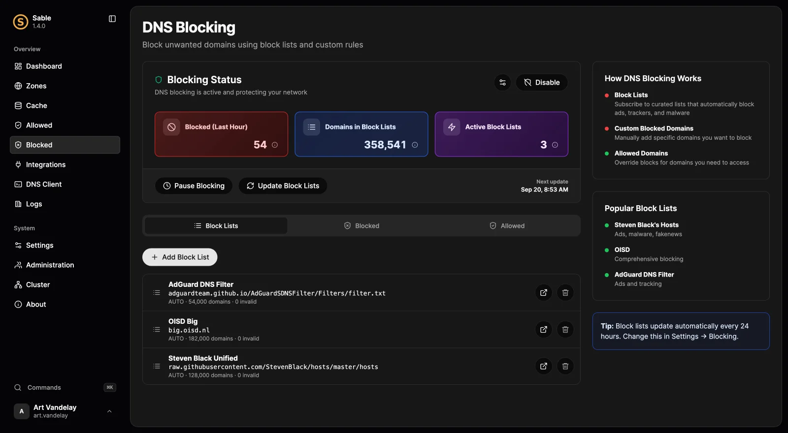
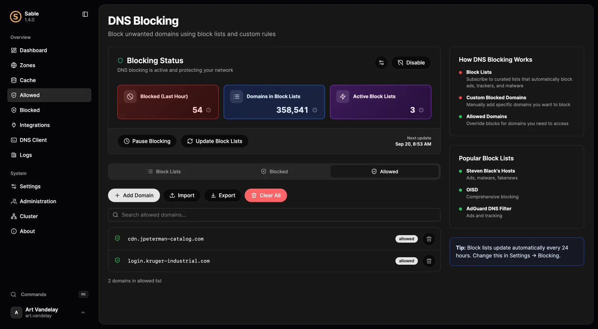

# Block unwanted domains

Start with a manageable list, observe what it blocks, and make narrow exceptions. DNS blocking applies across applications that use Sable, but cannot remove page elements or selectively filter two resources served from the same host name.

## Before you begin

Verify a [test device uses Sable](connect-network.md). On a cluster, make policy changes on the primary. Keep access to the console from a trusted device while testing a new policy.

## 1. Add a block list

Open **Blocked → Block Lists**, choose **Add Block List**, and select a curated source or enter a custom HTTP(S) subscription. Check that it downloads successfully and contributes domains before adding more sources.

Sable accepts domain lists, hosts-file lists, and common Adblock domain-rule syntax. Cosmetic rules and Adblock exception syntax are not imported as an allow policy; use Sable's explicit allowed-domain rules for exceptions.

## 2. Verify a blocked query

Pick a harmless domain that the selected list contains and query it from the test device. The default policy returns NXDOMAIN. Open **Logs → Queries** and inspect the explanation to confirm **Blocked by policy**, rather than assuming any NXDOMAIN was caused by blocking.

Sable also supports zero-address and custom-address responses. Choose these in blocking settings only when their behavior suits your clients; redirecting a blocked HTTPS name to a web page will not make its original TLS certificate valid.

## 3. Add a narrow exception

When a needed service breaks, identify the exact blocked host in the query log. Use the query explanation's allow action or add it under **Allowed**. Allowed domains override matching list and custom blocking rules.

Retest the client. DNS and application caches can delay the visible effect; distinguish a cached negative answer from a new blocked request. Do not allow a broad parent domain unless that whole subtree is intended to bypass the rule.

## Pause or bypass deliberately

**Pause Blocking** is a temporary diagnostic control. Resume promptly after the test; the in-memory pause resets on restart. For a persistent client exception, use `blocking.bypass_clients` with an IP or CIDR, and remember that a router proxy may hide the individual client address.

## Keep subscriptions healthy

Use **Update Block Lists** to retry sources immediately. A previously successful source can keep using its cached list during a download failure while other sources update. A source with no successful cached download cannot safely contribute a complete replacement.

Inspect last success, last error, and retry status. Sable backs off failed sources rather than hammering them. Never interpret an unchanged domain count alone as evidence of a failed update: the source may simply contain the same names.

## Next steps

Use [query explanations](troubleshooting.md) to investigate false positives and [logs and metrics](logging.md) to monitor dropped events and list health. Exact file formats, response modes, and retry timings are in the [blocking reference](../configuration.md#blocking).
