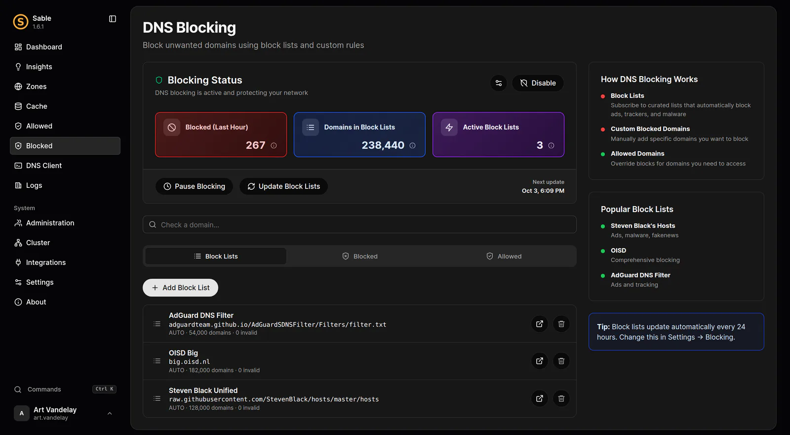
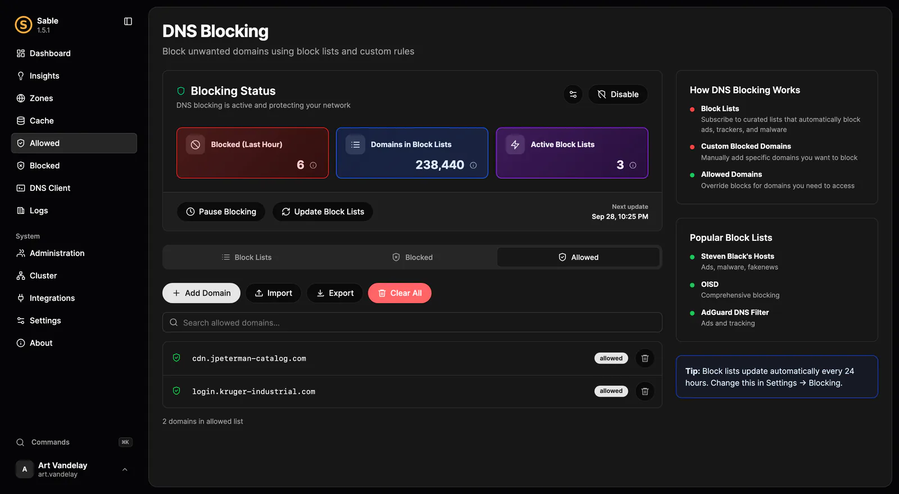

# Block unwanted domains

Start with a manageable list, observe what it blocks, and make narrow exceptions. DNS blocking applies across applications that use Sable, but cannot remove page elements or selectively filter two resources served from the same host name.

## Before you begin

Verify a [test device uses Sable](connect-network.md). On a cluster, make policy changes on the primary. Keep access to the console from a trusted device while testing a new policy.

## 1. Add a block list

Open **Blocked → Block Lists**, choose **Add Block List**, and select a curated source or enter a custom HTTP(S) subscription. Check that it downloads successfully and contributes domains before adding more sources.

While a catalog or custom list downloads and compiles, its Add control shows a spinner and prevents duplicate submissions. The dialog stays open during the operation. Manual add/update failures show error notices; connection failures and unrendered HTTP errors produce a dismissible notice without clearing your custom URL. Correct the cause before retrying.

Sable accepts domain lists, hosts-file lists, and Adblock rules that name a whole host: `||ads.example^`, optionally ending in `|` or `$important`. Like AdGuard Home, Technitium, and Pi-hole, Sable skips Adblock rules it can't apply to a name: rules with a path, a `*` wildcard, a regular expression, or any other modifier, and cosmetic rules. A list's details count them as **Unsupported rules**.

An exception such as `@@||cdn.example^` unblocks that host and its subdomains on every list, as it does in AdGuard Home and Technitium. It doesn't lift a `$important` rule or a domain you blocked yourself. Your own allowed domains still come first.

## 2. Verify a blocked query

Pick a harmless domain that the selected list contains and query it from the test device. The default policy returns NXDOMAIN. Open **Logs → Queries** and inspect the explanation to confirm **Blocked by policy**, rather than assuming any NXDOMAIN was caused by blocking.

Sable also supports zero-address and custom-address responses. Choose these in blocking settings only when their behavior suits your clients; redirecting a blocked HTTPS name to a web page will not make its original TLS certificate valid.

## 3. Add a narrow exception

When a needed service breaks, identify the exact blocked host in the query log. Use the query explanation's allow action or add it under **Allowed**. Allowed domains override matching list and custom blocking rules. A domain is on one of your own lists at a time: allowing a blocked domain takes it off **Blocked**, and blocking an allowed one takes it off **Allowed**. Importing a file works the same way.

When the device is in a rule set, the explanation names it. A block from the rule set's own domains or apps is changed in that rule set (**Blocked → Rule Sets**), not under **Allowed**, since a rule set's own blocks win over the allowed domains. **Check a Domain** at the top of the Blocking page answers for one device when you pick it.

Retest the client. DNS and application caches can delay the visible effect; distinguish a cached negative answer from a new blocked request. Do not allow a broad parent domain unless that whole subtree is intended to bypass the rule.

## Blocked ads come back on iPhones

On iOS 27 and iPadOS 27, **Connectivity Assist** (formerly Wi-Fi Assist) can retry a request that failed on Wi-Fi over cellular data. A blocked request counts as failed, so the retry goes out through the carrier's DNS and gets around Sable. The query log still shows the block, because the device asked Sable first.

Turn it off for the networks Sable serves: open **Settings → Wi-Fi**, tap the info button next to the network, and turn off **Connectivity Assist**. To turn it off everywhere, use the switch at the bottom of **Settings → Wi-Fi**. Apple describes the feature in [About Connectivity Assist](https://support.apple.com/en-us/127686).

Changing the blocking response type does not help. NXDOMAIN, zero-address, and custom-address answers all make the request fail, and a custom address pointed at a server that drops connections looks like slow Wi-Fi, which is what Connectivity Assist exists to rescue.

## Block at set times

A rule set can block everything, or just some apps, for its devices at set times each week, such as a bedtime. Open the rule set on **Blocked → Rule Sets** and choose **Add Schedule**: pick its days, start and end times, and whether it blocks everything or chosen apps. An end before the start runs into the next morning. While a schedule blocks everything, its devices still reach their allowed domains.

For one night off, use the buttons on the schedule's row instead of editing it. **Skip** passes over the next window, **Delay 30 Minutes** starts it later or gives 30 more minutes once it's on, and **End Now** stops it until the window would have ended. **Resume** undoes them. The schedule runs as usual from its next window. Each device's panel in **Insights** shows its rule set's schedules too. The settings behind schedules are in the [configuration reference](../configuration.md#rule-sets).

## Pause or bypass deliberately

**Pause Blocking** is a temporary diagnostic control. Resume promptly after the test; the in-memory pause resets on restart. For a persistent client exception, add the device, address, or network to a rule set with its **Blocking** switch off (**Blocked → Rule Sets**), and remember that a router proxy may hide the individual client address.

## Keep subscriptions healthy

Use **Update Block Lists** to retry sources immediately. A previously successful source can keep using its cached list during a download failure while other sources update. A source with no successful cached download cannot safely contribute a complete replacement.

Since 1.0.1, Hagezi Pro uses its working AdBlock feed. Existing subscriptions to the retired URL migrate automatically while retaining cached data. In Docker, a DNS lookup failure during download can come from container DNS rather than Sable forwarding; follow the [container DNS troubleshooting steps](install-docker.md#block-list-downloads-fail-with-a-dns-lookup-error).

Inspect last success, last error, and retry status. Sable backs off failed sources rather than hammering them. Never interpret an unchanged domain count alone as evidence of a failed update: the source may simply contain the same names.

## Next steps

Use [query explanations](troubleshooting.md) to investigate false positives and [logs and metrics](logging.md) to monitor dropped events and list health. Exact file formats, response modes, and retry timings are in the [blocking reference](../configuration.md#blocking).
