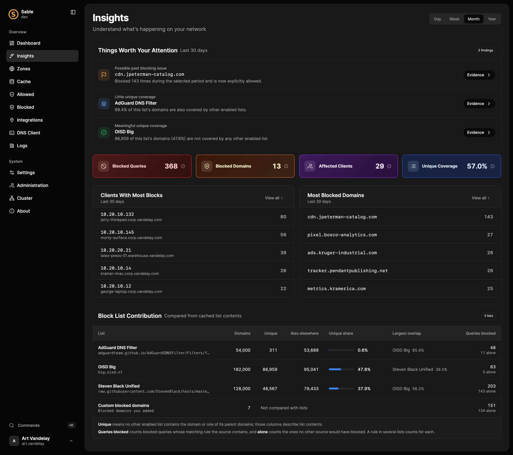
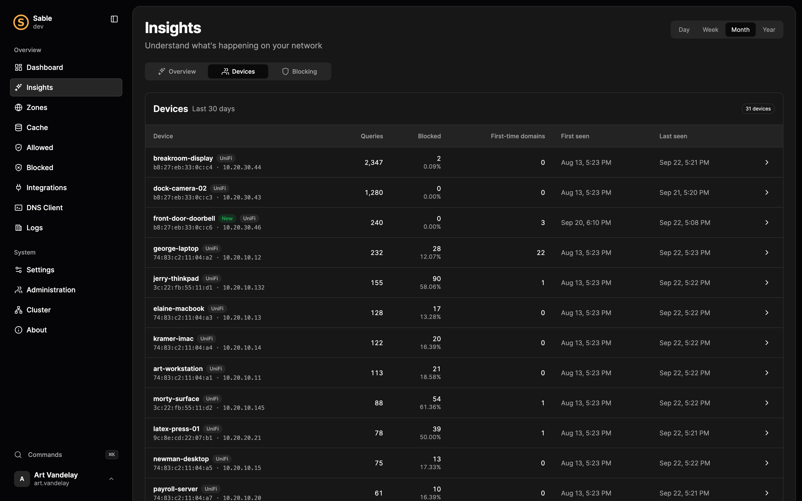
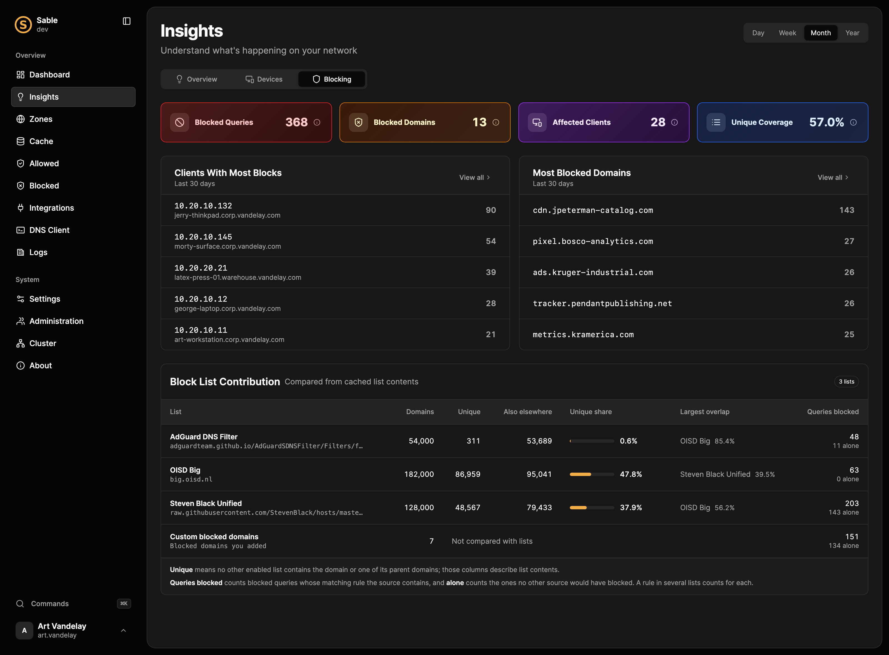

# Understand your network with Insights

Insights reads what Sable already records and tells you what changed, what each device is, and what is worth a look. Every finding shows the evidence behind it and links to the exact queries in the query log, so you never have to take Sable's word for it.

Insights runs entirely on your server. It uses fixed rules and lookup tables, not machine learning or a cloud service, and none of it runs while Sable answers DNS.

## Before you begin

Insights needs query logging, which is on by default. Open **Insights** from the sidebar or the command palette. You need permission to read logs, blocking, or both; each section shows only what you may read.

Right after an upgrade, Sable fills in device history from the query log it already keeps, so Insights knows which devices were already on the network from the first day.

## The Overview

The Overview opens with one sentence about what stands out, such as "dock-camera-02 went quiet, breakroom-display is 13× busier than usual, and file-server woke up at 3 AM." Select a name in it to open that finding. Below it are the numbers for the selected range and **Worth a Look**.

Each finding opens a drawer with fact cards, **Why Sable surfaced this**, what it could mean, and **How Sable decides**. Findings with a shape to them also draw it: a device that went quiet or got busy is shown beside each day of its week before, one active at an unusual hour beside its usual day, and a check-in as one mark per lookup across the last day. Point at or tap a bar to see its count, or drag across the bars to read each in turn. Use **View Query Logs** to see the exact queries it counted.

Insights reports:

- **New device on the network.** A device first seen during the range, while Sable was already watching.
- **Went quiet** and **Unusually busy.** A device's last day compared with its own average over the week before.
- **Active at an unusual hour.** A device with a steady daily routine that was busy at an hour it had not used in two weeks.
- **Talking somewhere new.** An appliance, such as a camera, doorbell, or TV, that started calling services it never used. A laptop doing the same is ordinary and is not reported.
- **Started using a new app.** A device that began using an app, such as Discord or Zoom, it had not used before.
- **Checks in on a schedule.** A name only one device looks up, again and again, at a steady interval through the night. This is how a smart device's heartbeat looks, and also how software phoning home looks.
- **Blocking findings.** Names that were blocked before you allowed them, block lists that stopped updating, and lists that add little of their own.

**Top Apps** and **Busiest Devices** rank the whole network for the selected range. Open an app to see the domains it used, each linked to its queries, and the devices that used it. Open a device to see its details.

## Devices

The **Devices** tab lists every device that sent queries in the range. Sable keeps a device's addresses together through the names you give it, UniFi, and the server's neighbor table, so a laptop's IPv4 and changing IPv6 addresses count as one device.

The machine Sable runs on is marked **This server**, and the rest of its cluster **Sable node**. What Sable looks up for itself on a timer, such as its dynamic DNS updates, UniFi sync, and block list downloads, never counts as a check-in.

Open a device to see its maker, apps, busiest domains, and first-time domains.

### Name a device

Use the pencil beside the device's name. A name follows the hardware address when Sable knows it, so it survives IP changes.

When a device has more than one name, Sable uses yours first, then the name UniFi reports, then a [local host override](../configuration.md#local-host-overrides), then reverse DNS. The badge beside the name says which one it is. The dashboard's client rankings use the same order.

### What a device is

Sable names the maker from the device's hardware address and guesses its type from the maker, its name, and the services it talks to. **What it is** shows the guess, how sure Sable is (**Confident**, **Likely**, or **Unsure**), and the clues behind it.

When a guess is wrong, use the pencil beside it and choose the right type. The first choice, marked **(detected)**, hands the decision back to Sable. Your correction is kept against the hardware address, like a name.

Devices with a private, randomized hardware address have no maker, so their type rests on their name and the services they use.

## Hide what you have seen

Every finding's drawer ends with **Seen it?**:

- **Dismiss** hides the finding for a day.
- **Snooze a Week** hides it for a week.
- **That's Normal** hides it until you show it again.

Hiding applies to everyone who uses Insights. Hidden findings are listed under the findings card, where **Show Again** brings one back. You need permission to change settings to hide findings.

## Get alerts

Insights can send each new finding worth a look to Slack, Discord, ntfy, Pushover, or a webhook. Use the bell beside the range control at the top of Insights, which also shows whether alerts are on, paused, or off, then pick where under **Send To**:

- **Webhook** posts JSON to a URL, which works with Home Assistant and anything else that takes a JSON POST. Its `text` and `content` fields also make a plain Slack or Discord message.
- **Slack** posts to an incoming webhook as a card: the finding, its reasons, a colored bar for how much it matters, and a button to Insights.
- **Discord** posts to a channel webhook as an embed colored by how much the finding matters, with its reasons and a link to Insights. It never mentions anyone.
- **ntfy** posts plain text with a title to your topic's URL, which ntfy shows as a notification.
- **Pushover** asks only for your application token and user key; Sable knows Pushover's URL. Send Test says what Pushover rejected, such as a wrong token. Clear both keys to turn Pushover alerts off.

Use **Preview** to see exactly what Sable would send, before you save, and **Copy** in its corner to take it with you. Tokens and `Authorization` values are cut short.

Use **Send Test** to check the webhook. Each finding is sent once, and anything you hid is skipped. When you first set a webhook, Sable takes stock of what it already knows without sending it, so you are not flooded with old news. On a cluster, only the primary sends alerts.

Use **Pause** to stop alerts without losing the webhook, and **Resume** to start them again. Findings that turn up while alerts are paused are not sent when you resume. **Send Test** still works while paused. For Slack, Discord, and Pushover it also checks that the service itself answered, so a mistyped URL shows an error instead of looking like it worked.

For a plain webhook or ntfy, open **Advanced** for two more options:

- **Check for an ntfy Receipt** only counts a send when ntfy answers with a message ID. It shows for ntfy. Without it, any server that answers counts, so a typo like `nfty.sh` can look like it worked.
- **Headers** are sent with every alert. Use `Authorization` to reach a protected ntfy topic, or `Priority` and `Tags` to change how the notification looks.

You can also set alerts in `sable.toml`; see [Devices and Insights](../configuration.md#devices-and-insights).

## Blocking

The **Blocking** tab shows blocked queries, the clients and domains behind them, and how much each block list contributes that no other list covers.

