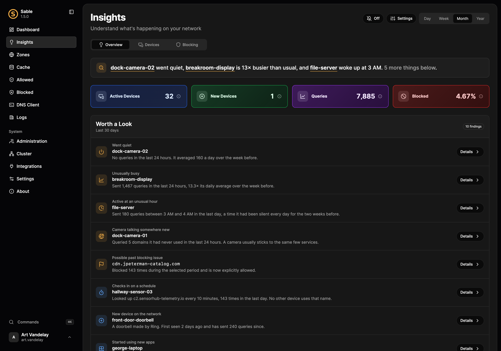
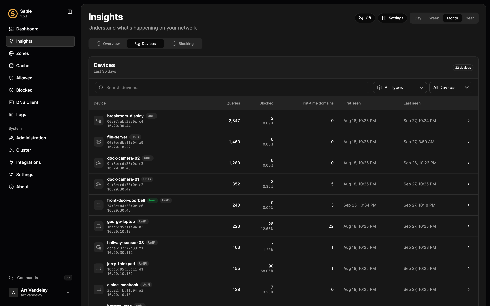
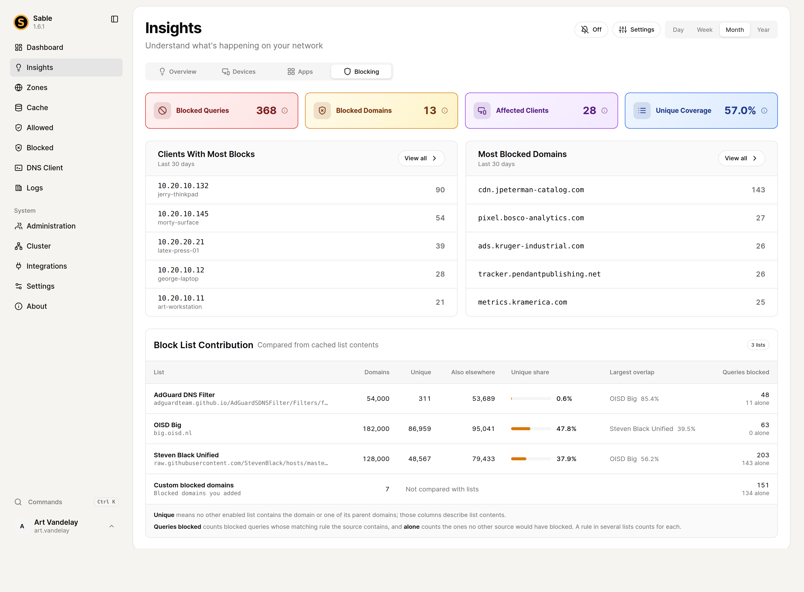

# Understand your network with Insights

Insights reads what Sable already records and tells you what changed, what each device is, and what is worth a look. Every finding shows the evidence behind it and links to the exact queries in the query log, so you never have to take Sable's word for it.

Insights runs entirely on your server. It uses fixed rules and lookup tables, not machine learning or a cloud service, and none of it runs while Sable answers DNS.

## Before you begin

Insights needs query logging, which is on by default. Open **Insights** from the sidebar or the command palette. You need permission to read logs, blocking, or both; each section shows only what you may read.

Right after an upgrade, Sable fills in device history from the query log it already keeps, so Insights knows which devices were already on the network from the first day.

## The Overview

The Overview opens with one sentence about what stands out, such as "dock-camera-02 went quiet, breakroom-display is 13× busier than usual, and file-server woke up at 3 AM." Select a name in it to open that finding. Below it are the numbers for the selected range and **Worth a Look**.

Each finding opens a drawer with fact cards, **Why Sable surfaced this**, what it could mean, and **How Sable decides**. Findings with a shape to them also draw it: a device that went quiet or got busy is shown beside each day of its week before, one active at an unusual hour beside its usual day, and a check-in as one mark per lookup across the last day. Point at or tap a bar to see its count, or drag across the bars to read each in turn. Use **View Query Logs** to see the exact queries it counted.

Insights reports:

- **New device on the network.** A device first seen during the range, while Sable was already watching.
- **Went quiet** and **Unusually busy.** A device's last day compared with its own average over the week before.
- **Active at an unusual hour.** A device with a steady daily routine that was busy at an hour it had not used in two weeks.
- **Talking somewhere new.** An appliance, such as a camera, doorbell, or TV, that started calling services it never used. A laptop doing the same is ordinary and is not reported.
- **Started using a new app.** A device that began using an app, such as Discord or Zoom, it had not used before.
- **Checks in on a schedule.** A name only one device looks up, again and again, at a steady interval through the night. This is how a smart device's heartbeat looks, and also how software phoning home looks.
- **Devices that don't use Sable.** Devices UniFi shows online and busy that never sent Sable a lookup, and networks whose DHCP hands out other DNS servers. See [Devices that don't use Sable](#devices-that-dont-use-sable).
- **Blocking findings.** Names that were blocked before you allowed them, block lists that stopped updating, and lists that add little of their own.

**Top Apps** and **Busiest Devices** rank the whole network for the selected range. Open an app to see the domains it used, each linked to its queries, and the devices that used it. Open a device to see its details.

## Devices

The **Devices** tab lists every device that sent queries in the range. Sable keeps a device's addresses together through the names you give it, UniFi, and the server's neighbor table, so a laptop's IPv4 and changing IPv6 addresses count as one device.

The machine Sable runs on is marked **This server**, and the rest of its cluster **Sable node**. What Sable looks up for itself on a timer, such as its dynamic DNS updates, UniFi sync, and block list downloads, never counts as a check-in.

Open a device to see its maker, apps, busiest domains, and first-time domains.

### Find a device

Search the list by name, hardware or IP address, maker, or type. The filters beside the search narrow it to one type, or to devices that are new, named, unnamed, or not using Sable. The page's address keeps the search and filters, so they last through a range change or a reload.

**Search Devices** in the command palette opens the list with your search already in place.

### Name a device

Use the pencil beside the device's name. A name follows the hardware address when Sable knows it, so it survives IP changes.

When a device has more than one name, Sable uses yours first, then the name UniFi reports, then a [local host override](../configuration.md#local-host-overrides), then reverse DNS. The badge beside the name says which one it is. The dashboard's client rankings use the same order.

### What a device is

Sable names the maker from the device's hardware address and guesses its type from the maker, its name, and the services it talks to. **What it is** shows the guess, how sure Sable is (**Confident**, **Likely**, or **Unsure**), and the clues behind it.

When a guess is wrong, use the pencil beside it and choose the right type. The first choice, marked **(detected)**, hands the decision back to Sable. Your correction is kept against the hardware address, like a name.

Devices with a private, randomized hardware address have no maker, so their type rests on their name and the services they use.

### Devices that don't use Sable

With [UniFi](unifi.md) connected, Insights compares what UniFi says is online with what asks Sable. A device that UniFi shows connected and passing traffic for the last 24 hours, with no lookup from any of its addresses, doesn't use Sable. It may have DNS set by hand, like a TV with `8.8.8.8` built in, or use a VPN or DNS over HTTPS. Either way, blocking, logging, and Insights can't see it.

Insights lists every such device in one finding, **Not using Sable**, so a new one can alert. The Devices tab lists them too, under **Not Using Sable**, and each one's drawer says so. Insights also reports a network whose DHCP hands out a DNS server that isn't Sable, such as a guest network handing out `1.1.1.1`.

Sable checks every address tied to a device before calling it silent: the ones UniFi lists, including every IPv6 address it has seen, any address Sable has seen with the device's hardware address, and IPv6 addresses built from it. On a cluster, a lookup to any node counts, so the finding waits until every node has reported. Two things keep it from blaming devices wrongly:

- **Gateway forwarding.** When a network's DHCP hands out the UniFi gateway and the gateway forwards to Sable, every lookup arrives as the gateway's. Insights leaves that network's devices out and says so in a separate finding instead.
- **Devices that are supposed to be quiet.** Use **That's Normal** on the finding to mark every device it lists. A device you haven't marked brings the finding back. Marked devices are listed under the findings card, where **Show Again** undoes it.

Change how long a device must stay silent in [Insights Settings](#choose-what-insights-shows-and-alerts). Sable needs a day of UniFi readings before it can tell traffic across the whole window, so a new setup reports nothing for the first day.

## Hide what you have seen

Use **Hide Finding** beside **Why Sable surfaced this** in a finding's drawer, then choose how long to hide it:

- **For a Day** hides it until tomorrow.
- **For a Week** hides it for a week.
- **That's Normal** hides it until you show it again.

A finding hidden for a day or a week comes back when the time is up, if it still applies. Hiding applies to everyone who uses Insights. Hidden findings are listed under the findings card, where **Show Again** brings one back. You need permission to change settings to hide findings.

## Choose what Insights shows and alerts

Use **Settings** beside the range control at the top of Insights to open **Insights Settings**.

Each kind of finding has three choices:

- **Show and alert** shows it in Insights and sends each new one as an alert. Everything that is news starts here.
- **Show only** keeps it in Insights without sending alerts.
- **Off** stops Insights from looking for it at all.

Some kinds have limits you can change, such as how many lookups make a device **Unusually busy**, or how many new domains make it **Talking to new places**. Raise a limit to hear less, or lower it to hear more. The findings that compare block lists are never news, so they can only be shown or turned off. **Reset to Defaults** puts every choice and limit back the way Sable ships them.

Anyone who can read logs can see these settings. Changing them needs permission to change settings.

You can also set these in `sable.toml`; see [Devices and Insights](../configuration.md#devices-and-insights).

## Get alerts

Sable can send each new finding worth a look to your phone, a chat channel, a webhook, or your browser, and it skips anything you hid. Set up where alerts go in **Settings > Alerts**. See [Get alerts](alerts.md).

The bell beside **Settings** shows whether Insights alerts are **On**, **Paused**, or **Off**. Hover over it to see why, or click it to open **Settings > Alerts**.

## Blocking

The **Blocking** tab shows blocked queries, the clients and domains behind them, and how much each block list contributes that no other list covers.

