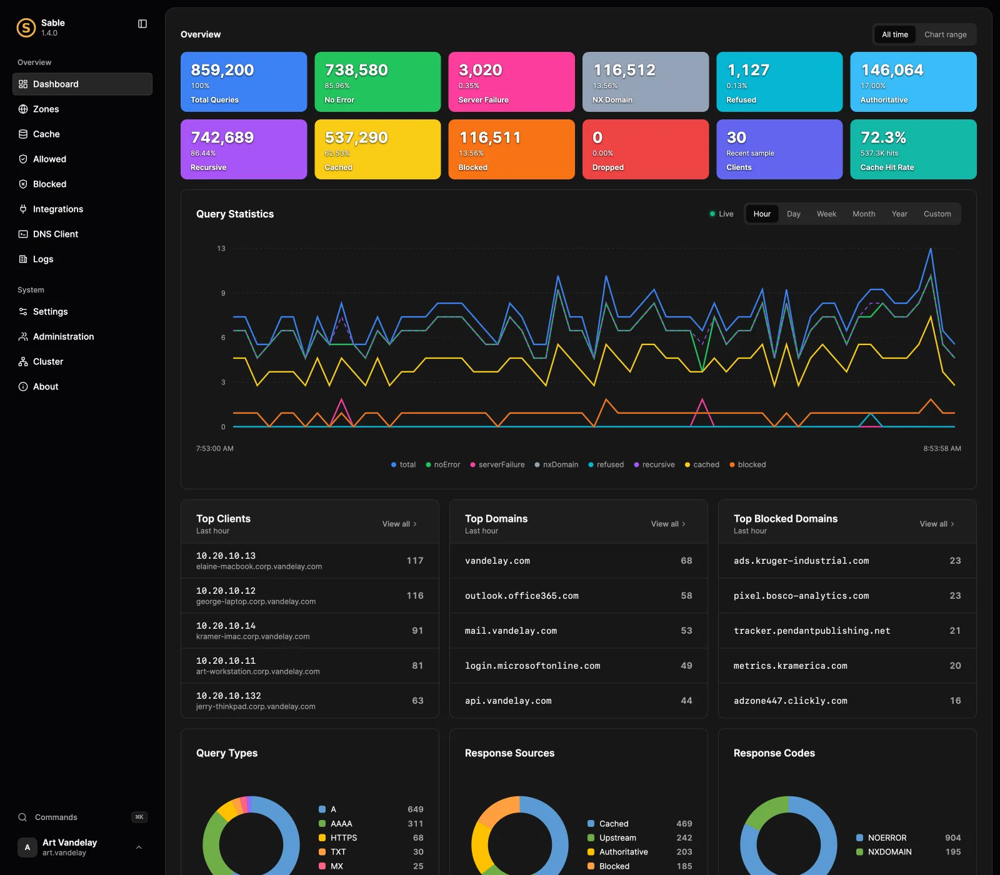

# Use logs and metrics

Use the dashboard to notice a change, query history to explain a request, and metrics to monitor ongoing health. They are complementary views with different retention and failure behavior.

## Read the dashboard in context

Choose the time range before comparing totals or rankings. The range affects the chart, top clients, top domains, blocked names, record types, response sources, and response codes. The selected range is remembered in a browser cookie.

Minute statistics persist across restarts. Lifetime totals are stored separately from retained chart buckets. Downtime appears as a gap, not invented activity. Check the selected card scope and lifetime-versus-range preference before comparing numbers across views.

## Retain only the history you need

Open **Settings → Logging** and choose query-log, server-log, and statistics retention. Defaults are 30 days for query logs, 60 days for server logs, and one fixed year for statistics.

Shortening retention hot-reloads and schedules pruning; it is not an archive operation. Export required records before reducing retention. Query history can reveal sensitive client activity, so set retention to match operational needs rather than keeping it forever by default.

Server-log level accepts `debug`, `info`, `warn`, or `error` and applies to persistence and stderr. Use debug only as long as needed for investigation. Buffer, batch, and flush settings require a controlled restart because they change the worker's shape and cadence.

## Follow one request

Use **Logs → Queries**, filter a bounded window, and click the matching row. The detail drawer explains policy, cache, route, resolution, and DNSSEC decisions. See [Explain a DNS answer](troubleshooting.md).

Query recording is asynchronous and bounded. If storage cannot keep up, Sable drops telemetry instead of delaying DNS. A missing log row is therefore not proof that the DNS query never happened; compare dropped-event and write-error metrics.

## Add Prometheus monitoring

Create a token with `metrics.read` and scrape `/metrics` through a trusted administrative endpoint. Do not put the token in the URL. Monitor upstream errors, response-write failures, response latency, query-log drops, persistence failures, block-list health, and cluster synchronization.

`sable_dns_response_duration_seconds` uses bounded source, protocol, cache, and response-code labels. Prometheus counters describe the local process; scrape each node. Cluster membership gauges do not turn every node's traffic counters into one cluster-wide series.

## Keep a fallback for database failures

Server logs also go to stderr. Use `journalctl -u sable` for native services or `docker logs sable` for containers when the database itself fails. Export incident evidence before repair and remove secrets or unnecessary client details before sharing.

Exact settings and metric names are in [configuration](../configuration.md#query-logging) and the [operations runbook](../operations.md#metrics-and-alerts).
