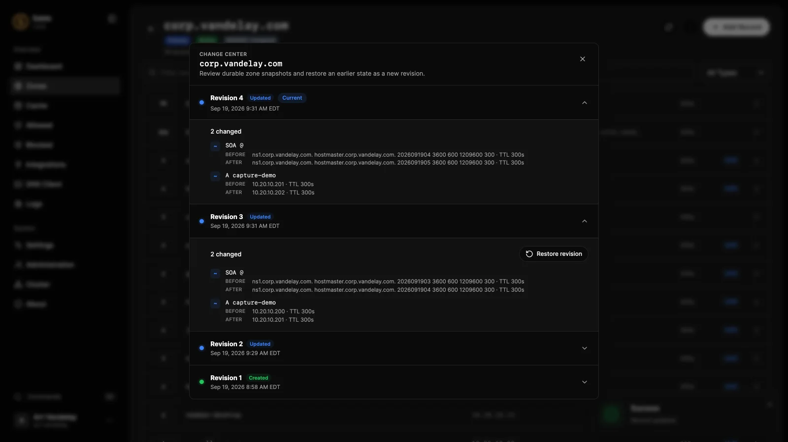

# Give your services names

Replace a memorable IP address with a meaningful name such as `nas.home.arpa`. A Primary zone is the source of truth for those names; you can add records in the console and inspect every change later.

## Before you begin

Use a working Sable resolver and an account allowed to manage the zone. Choose a namespace you control, or `home.arpa` for a residential private network. The examples below use documentation addresses; replace them with your real LAN addresses.

## 1. Create the zone

Open **Zones**, create a zone named `home.arpa`, and select **Primary Zone**. Sable provisions the required apex SOA and NS records. You do not put zones in `sable.toml`: records live in the database and activate in memory when saved.

## 2. Add the host

Open the zone and choose **Add Record**:

| Field | Value |
| --- | --- |
| Type | A |
| Name | `nas` |
| IPv4 address | `192.0.2.20` |
| TTL | `300` seconds |

Add an [AAAA record](../reference/records/aaaa.md) too if the service has a working IPv6 address. Do not publish IPv6 merely because the form offers it; clients may prefer it.

For another name pointing to that host, create a [CNAME](../reference/records/cname.md) named `files` with target `nas.home.arpa.`. The trailing dot in examples makes fully qualified names explicit.

## 3. Check the answer

```sh
sable query --server 192.0.2.53:53 nas.home.arpa A
sable query --server 192.0.2.53:53 files.home.arpa A
```

The first answer should contain the NAS address; the second should follow the alias. Then test from a device configured to use Sable. If only direct queries work, [check the client's DNS path](connect-network.md).

## 4. Make changes deliberately

Click a record row to inspect or edit it. TTL is measured in seconds and controls how long other resolvers and clients may cache the answer. Lower the old TTL ahead of a planned move; reducing it after a change does not recall an answer already cached elsewhere.

Use a comment to explain a non-obvious record. Integration-owned and mirrored records are read-only; update their source instead of trying to fight synchronization.

## Undo a mistake

Open the zone's **Actions → Change Center**, compare revisions, and restore the intended one. Restoration creates a new revision and advances the SOA serial; it does not erase the history. See [Import, export, and undo changes](import-export.md).



## Avoid accidental shadowing

Creating a local Primary zone for a public domain makes Sable authoritative for that namespace. Missing public names beneath it will not automatically fall through to public DNS. Prefer a dedicated private subdomain or a [Forwarder zone](../reference/zones/forwarder.md) when another server owns the whole private namespace.

DNS maps names to answers, not to HTTP paths. An A record cannot redirect a browser to `https://host:8443/app`; that belongs in your web server or reverse proxy.
