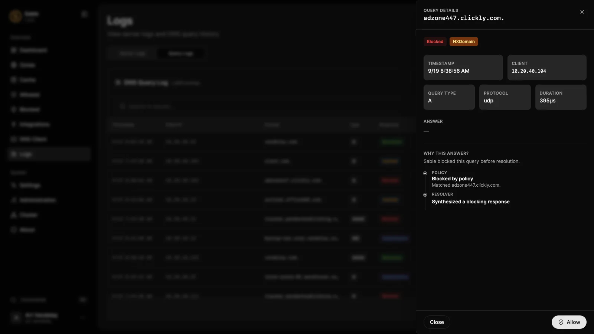

# Explain a DNS answer

Work from one reproducible question: the client, query name, record type, server, and time. A failed application request is not enough to identify whether the problem is DNS, TLS, routing, or the application itself.

## 1. Query the intended node directly

```sh
sable query --server 192.0.2.53:53 app.example.com A
sable query --transport tcp --server 192.0.2.53:53 app.example.com A
```

Use the built-in **DNS Client** to choose an enrolled cluster node when testing that node's advertised DoH endpoint. Direct queries separate Sable's answer from the DNS server your operating system happened to choose.

## 2. Find the matching log entry

Open **Logs → Queries**, constrain the time range, and filter by client, name, type, or response code. Click the row to open the detail drawer. Check the timestamp and protocol so you do not diagnose an older cached or unrelated request.



## 3. Follow the explanation

| Signal | What to investigate |
| --- | --- |
| Blocked by policy | Matching list or custom rule, allowed override, and client bypass |
| Cache hit | Whether this is an older answer; check TTL and the original upstream or local source |
| Authoritative/local answer | The most-specific matching zone or host override, including disabled or expired records |
| Forwarded answer | Selected route, upstream reachability, transport, and timeout |
| Recursive failure | Outbound DNS access, authority failures, and DNSSEC explanation |
| DNSSEC bogus / EDE | Broken signature, parent DS mismatch, or unsigned split-horizon data beneath a signed delegation |

NXDOMAIN means the name does not exist in that answer's namespace. NOERROR with no answer can mean the name exists but not the requested type. REFUSED is a policy refusal, not necessarily a network problem. SERVFAIL is a processing or resolution failure; inspect the explanation before changing settings.

## 4. Separate server cache from client cache

Repeat a direct query after correcting the source. Use **Cache** to inspect or purge relevant cached data when appropriate. Purging Sable's cache does not flush client, browser, VPN, or upstream caches.

Do not repeatedly flush everything to conceal a reproducible wrong answer. Capture the original query and explanation first so you can tell whether the underlying cause actually changed.

## 5. Check outside DNS

If the answer is correct, verify the returned address is reachable and the service accepts the requested port and host name. DNS does not issue TLS certificates or rewrite web URLs. If Sable sees no query, inspect the client's resolver configuration, IPv6, VPN, and browser secure-DNS settings.

## Preserve useful evidence

Save the Sable version, query name/type, response code, time window, and relevant logs. Remove tokens, private credentials, and unnecessary client data before sharing. Query history can contain sensitive browsing information. Use the [private security reporting process](../../SECURITY.md) for suspected vulnerabilities.

For service startup, storage, and cluster incidents, continue with the [operations runbook](../operations.md#troubleshooting).
