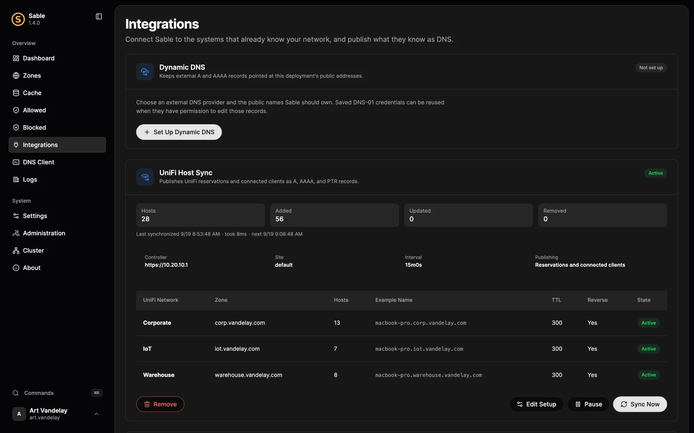

# Sync names from UniFi

Use the controller's reservations and connected clients to maintain A, AAAA, and PTR records. Map networks once; Sable updates only records marked as owned by the UniFi integration.

## Before you begin

Prepare the controller URL, its site, credentials accepted by that controller, and a DNS namespace for each network. Ensure Sable can verify the controller's HTTPS certificate. Prefer a trusted or explicitly pinned CA over disabling verification.

On a cluster, run setup on the primary. Replicas receive records through Sable replication; they do not each poll the controller.

## 1. Run the wizard

Open **Integrations → UniFi Host Sync** and connect to the controller. Select reservations, active clients, or both. When both describe one device, the reservation wins.

The wizard lists networks and previews the records before saving. Credentials go to Sable's encrypted vault, not TOML. Review skipped or normalized device names so you know what users will actually resolve.

## 2. Map networks to zones

Map each network to a zone and choose a hostname template. Mapping uses the controller's network identifier, so a display-name change does not silently move the zone.

If several networks share one zone, keep `{{network}}` in every mapping's template. This avoids devices with the same hostname on different VLANs repeatedly replacing each other's names. A typical template is `{{host}}.{{network}}.{{zone}}`.

Enable reverse DNS when appropriate. Sable derives the reverse zone from the network subnet and can provision missing Primary zones for the forward and reverse records.

## 3. Synchronize and verify

Save the reviewed mapping, use **Sync Now**, and check the result. Query a representative host's A or AAAA record and its PTR. Verify at least one device from each mapped network.

Records display a UniFi source badge and are read-only in the editor. Change the device name or address in the controller, or change the integration mapping. Hand-authored records in the same zone are not part of the synchronizer's ownership set.

## Keep it healthy

Check last successful synchronization, skipped devices, and connection errors. On a promoted cluster node, the replicated configuration and credentials let synchronization resume; any local CA-file path must also exist there.

If many names unexpectedly change, pause the integration while reviewing the controller data and mapping. Do not bulk-delete hand-authored records as a cleanup shortcut. Use a backup or Change Center when restoring DNS data, then correct the upstream cause before resuming.

The [UniFi configuration reference](../configuration.md#integrations-unifi-host-synchronization) describes source selection, hostname normalization, TTL, and TLS settings.
